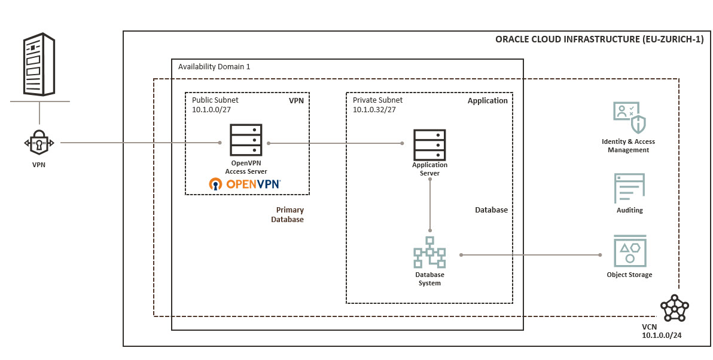
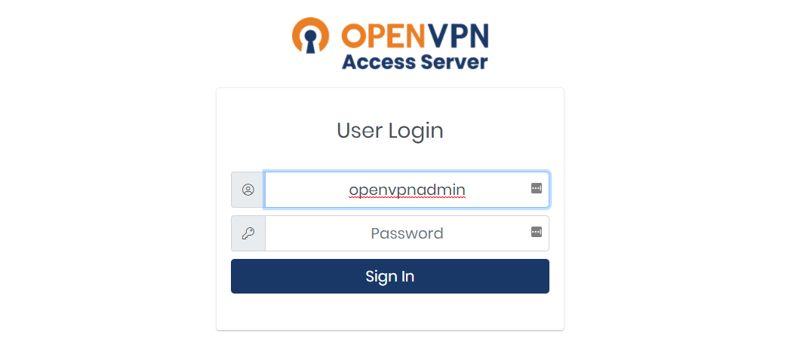
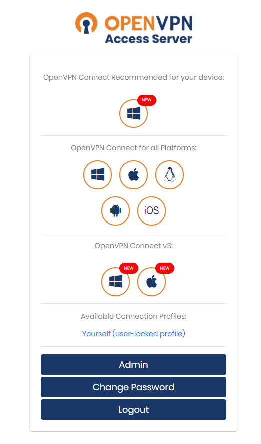

# OpenVPN Setup with Terraform
This example contains a Terraform configuration to a public/private subnet setup and an OpenVPN server up and running. Part of the OpenVPN provisioning code is reverse engineered from the Oracle Cloud Infrastructure OCI Resource Manager stack.

  

# What this example covers
 * A new compartment is created based on an existing compartment
 * VCN with regional public and private subnet provisioned
 * Routing tables and security lists provisioned
 * Internet gateway, NAT gateway and service gateway provisioned
 * OpenVPN Access Server from OCI Marketplace in Public Subnet- Free for 2 Connections
 * Oracle Linux Server in private Subnet for further actions like using as webserver, etc.

# Prerequisites
  * Oracle OCI CLI installed and configured 
  * Terraform up and running
  * Git client installed
  * SSH public key for OCI instance setup available


# Variables in terraform.tfvars file
Required variables according your Oracle Cloud Infrastructure environment.
| Variable                              | Value                                      |
|---------------------------------------|--------------------------------------------|
| TF_VAR_tenancy_ocid                   | OCI Tenancy OCID                           |
| TF_VAR_user_ocid                      | OCI User OCID                              | 
| TF_VAR_key_file                       | OCI API SSH Key File                       |
| TF_VAR_fingerprint                    | OCI API Fingerprint                        |
| TF_VAR_region                         | OCI Region                                 |
| TF_VAR_compartment_name               | OCI Compartment Name                       |
| TF_VAR_compartment_description        | OCI Compartment Description                |
| TF_VAR_compartment_master_ocid        | OCI Master Compartment OCID                |
| TF_VAR_openvpn_admin_password         | OCI OpenVPN inital login password          |


## Example to export specific variables:
```bash
export TF_VAR_tenancy_ocid=<your_tenancy_ocid>
export TF_VAR_user_ocid=<your_username_OCID>                              
export TF_VAR_private_key_path=<your_ssh_private_key>   
export TF_VAR_fingerprint=<your_public_key_fingerprint>
export TF_VAR_region=<your_OCI_region>                           
export TF_VAR_compartment_name=<your_compartment_name>
export TF_VAR_compartment_description=<your_compartment_description>
export TF_VAR_compartment_master_ocid=<your_OCID of the master compartment>
export TF_VAR_openvpn_admin_password=<your_openvpn_inital_password_for_user_openvpnadmin>
```

# Usage

 * Define the provider specific variables either in terraform.tfvars or via ENV variables
 * Initialize the OCI terraform provider


## Terraform init

```bash
$ terraform init
```

## Terraform plan

```bash
$ terraform plan -out=openvpn.tfplan
```

## Terraform apply
```bash
$ terraform apply openvpn.tfplan
```

# SSH Access
The public SSH key for the compute instance is provided in file _variables.tf_ - the example private key to get access to the compute instance when OpenVPN tunnel is open is available in subdirectory ssh.

# OpenVPN URL
The public IP address is part of the Terraform output. To get the OVPN client configuration file:
* https://<your_openvpnas_public_ip_here>/?=connect

Admin console
* https://<your_openvpnas_public_ip_here>/admin

## OpenVPN Login and Download the OVPN Client or Profile

Login with username _openvpnadmin_ and the provided password.

  

Download client or user-locked profile.

  

Login into compute instance when OpenVPN tunnel is running with the provieded SSH key. User is _opc_.

  

